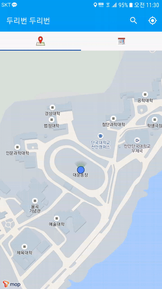
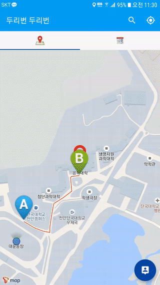
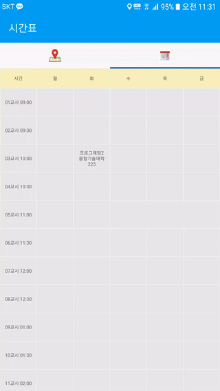

# DuribonDuribon

##	Overview

Dankook University Cheonan Campus route guide application (Google Android)

## Preview

## Application Info

Supported OS:  Android JellyBean ~ Nugat

Used Library: TMap API, ButterKnife, Facebook Stetho, Android Espresso

Developed by: Kwang Soo Jeong (Neon K.I.D), Jun Hyeong Kim (Imblock), Dow Hyn Kim 
